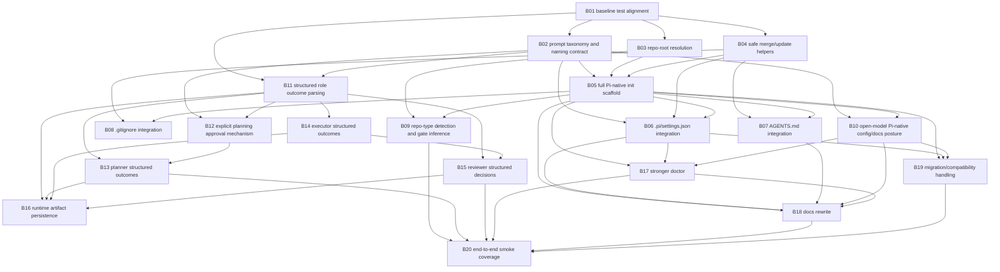

# Pi-native portable Purser refactor plan

Status: proposed for human review
Source spec: `specs/2026-04-23-pi-native-portable-purser-refactor.md`

## Planning intent

This is a **review artifact**, not the final Beads mutation step.

It proposes a bead graph for refactoring Purser into a Pi-native, portable orchestration framework. The graph is organized to reduce bootstrap risk by front-loading the foundational work that makes later self-dogfooding safer.

The plan intentionally separates:

- **foundation and alignment work**
- **scaffolding / portability work**
- **runtime protocol hardening**
- **docs and polish**

## Planning principles

1. Do not trust the current loop to refactor its own weakest contracts first without human review.
2. Front-load beads that reduce meta-recursive risk:
   - docs/CLI/test alignment
   - repo-root detection
   - safe scaffold merge helpers
   - prompt layout clarification
3. Keep beads atomic and independently verifiable.
4. Prefer creating enabling infrastructure before migration-heavy edits.
5. Treat reviewer/protocol hardening as a distinct milestone after setup/scaffolding is in better shape.

## Proposed epics / milestones

### M1. Baseline alignment and naming decisions
- stabilize tests
- remove current contract drift
- lock prompt/layout naming decisions

### M2. Pi-native scaffold and repo portability
- repo-root detection
- full `purser init` scaffold
- `.pi/settings.json` integration
- `AGENTS.md` merge/update
- `.gitignore` merge/update
- repo-type gate inference

### M3. Runtime contract hardening
- structured planner/executor/reviewer outcomes
- explicit planning approval state/mechanism
- improved runtime artifact logging
- reduced regex dependence in review

### M4. Doctor, docs, and migration polish
- stronger `doctor`
- docs rewrite to Pi-native posture
- model guidance for Codex-through-Pi, `gpt-oss`, `gemma4`, `qwen3.5`, Ollama Cloud
- migration and compatibility handling

## Proposed bead graph

### B01 — Align failing tests and current planner approval wording
**Purpose**
Fix immediate drift between implementation and tests so the repo has a trustworthy green baseline.

**Scope**
- reconcile planner approval wording between tests and implementation
- make current tests pass without introducing the larger refactor yet
- update only the minimum code/tests needed for alignment

**Acceptance criteria**
- `uv run pytest -q` passes
- planner approval wording is consistent between implementation and tests
- no unrelated behavior changes are introduced

**Depends on**
- none

---

### B02 — Define the Pi-native prompt taxonomy and public naming contract
**Purpose**
Lock down the prompt/file naming model before scaffold generation changes are implemented.

**Scope**
- define runtime role prompt names
- define operator workflow prompt names
- define on-disk layout under `.purser/`
- define the documented Pi slash-command mapping
- record the naming contract in docs or architecture notes

**Acceptance criteria**
- there is one documented prompt taxonomy covering role prompts vs workflow prompts
- prompt filenames and command names are explicit and stable
- naming decisions are reflected in the plan/docs used by subsequent beads

**Depends on**
- B01

---

### B03 — Add repo-root resolution utilities and adopt them in CLI entry points
**Purpose**
Make Purser operate from nested directories inside a repo instead of assuming current working directory is the repo root.

**Scope**
- add repo-root detection utility, preferably Git-aware
- update CLI/config loading paths to use resolved repo root where appropriate
- ensure `init`, `doctor`, and runtime commands behave sensibly from subdirectories

**Acceptance criteria**
- running core commands from a nested repo directory resolves the repo root correctly
- tests cover repo-root resolution behavior
- current repo-root-sensitive behavior is preserved when already at root

**Depends on**
- B01

---

### B04 — Build safe merge/update helpers for repo-managed text and JSON files
**Purpose**
Create reusable, tested primitives for modifying `AGENTS.md`, `.pi/settings.json`, and `.gitignore` safely.

**Scope**
- add merge/update helper(s) for section-based markdown files
- add merge/update helper(s) for JSON settings files
- add append-if-missing helper(s) for ignore files
- design helpers to be idempotent and non-destructive

**Acceptance criteria**
- helpers can update an existing `AGENTS.md` without clobbering unrelated content
- helpers can merge `.pi/settings.json` `prompts` entries without deleting unrelated keys
- helpers can append `.gitignore` entries only when missing
- tests cover idempotency and preservation behavior

**Depends on**
- B01

---

### B05 — Expand `purser init` into full Pi-native scaffold generation
**Purpose**
Turn `purser init` into the main portable adoption entry point.

**Scope**
- scaffold `.purser.toml`
- scaffold `.purser/prompts/` using the new prompt taxonomy
- create `specs/` if needed
- create `.purser/README.md` or equivalent local guidance
- use repo-root resolution
- use safe merge/update helpers where applicable
- report created/updated/skipped files clearly

**Acceptance criteria**
- `purser init` creates a full Pi-native scaffold in repo root
- repeated `purser init` runs are idempotent
- `purser init --force` behavior is explicit and safe
- tests cover scaffold generation from nested directories and re-run behavior

**Depends on**
- B02
- B03
- B04

---

### B06 — Implement `.pi/settings.json` prompt-directory integration
**Purpose**
Make operator workflow prompts discoverable by Pi after `/reload`.

**Scope**
- ensure `.pi/settings.json` is created or merged during init
- wire Pi prompts to the canonical Purser prompt directory
- verify prompt filenames align with intended slash-command names
- update docs/examples accordingly

**Acceptance criteria**
- `.pi/settings.json` contains the expected prompt directory entry after init
- existing settings are preserved
- prompt filenames map cleanly to documented Pi slash commands
- tests cover create and merge behavior

**Depends on**
- B02
- B04
- B05

---

### B07 — Implement `AGENTS.md` Purser-owned section management
**Purpose**
Ensure repo-local agent guidance reflects Purser’s Pi-native role and workflow.

**Scope**
- create/update a clearly delimited Purser section in `AGENTS.md`
- include Pi-native workflow guidance and human approval boundary
- preserve unrelated content
- make updates idempotent

**Acceptance criteria**
- `AGENTS.md` is created if missing or updated if present
- the Purser section states Purser is tooling/framework, not the repo’s product unless explicitly requested
- repeated init does not duplicate the section
- tests cover create, update, replace, and preserve cases

**Depends on**
- B04
- B05

---

### B08 — Implement `.gitignore` runtime-artifact integration
**Purpose**
Reduce adoption friction by making local runtime files easy to ignore safely.

**Scope**
- append recommended ignore entries when missing
- avoid duplicates or destructive rewrites
- document which entries are recommended vs optional

**Acceptance criteria**
- `.gitignore` receives Purser-related ignore entries only when missing
- existing `.gitignore` content is preserved
- tests cover additive behavior and idempotency

**Depends on**
- B04
- B05

---

### B09 — Add repo-type detection and starter gate inference
**Purpose**
Generate better starter config for consumer repos, especially Python + `uv` repos.

**Scope**
- detect at least Python, Node, Rust, Go repo signals
- infer starter gates from repo files where practical
- prefer `uv run ...` defaults for Python repos using `uv`
- keep output conservative when repo tooling is unclear

**Acceptance criteria**
- Python/`uv` repos receive `uv run` starter gates
- other supported repo types receive reasonable starter examples
- unclear repos fall back safely rather than inventing misleading commands
- tests cover repo-type detection and default gate selection

**Depends on**
- B03
- B05

---

### B10 — Update config defaults and docs for Pi-native open-model posture
**Purpose**
Align starter config and documentation with Option A and open-model-friendly Pi routing.

**Scope**
- revise starter config examples and defaults where appropriate
- remove proprietary-first posture from docs and templates
- document Codex-through-Pi and Pi-routed `gpt-oss`, `gemma4`, `qwen3.5`, and Ollama Cloud examples
- decide whether model defaults should be explicit examples or require user configuration

**Acceptance criteria**
- docs and starter config reflect a Pi-native, open-model-friendly posture
- role model routing remains configurable per role
- Codex is described as supported through Pi rather than as a separate host surface

**Depends on**
- B02
- B05

---

### B11 — Introduce structured role outcome parsing primitives
**Purpose**
Lay the parsing foundation for machine-readable planner/executor/reviewer outcomes.

**Scope**
- define structured outcome schemas or typed payloads
- implement parsing helpers for Pi-returned structured payloads
- support clear validation errors when payloads are missing or malformed
- allow a migration path from current prose-only behavior

**Acceptance criteria**
- parser(s) can extract and validate role outcome payloads from Pi output
- invalid or missing payloads fail clearly
- tests cover valid and invalid planner/executor/reviewer payload parsing

**Depends on**
- B01
- B02

---

### B12 — Add explicit planning approval mechanism
**Purpose**
Replace prompt-only planning approval with a machine-enforceable contract.

**Scope**
- choose and implement one approval mechanism
- connect it to `human_approve_plan = true`
- make planner behavior fail clearly when approval is required but absent
- document the operator workflow

**Acceptance criteria**
- planning approval can be enforced mechanically
- clear user-facing errors or instructions are shown when approval is missing
- tests cover approved and unapproved planning flows

**Depends on**
- B02
- B11

---

### B13 — Migrate planner flow to structured outcomes and approval enforcement
**Purpose**
Make planner behavior robust and machine-validated.

**Scope**
- update planner prompt/contract to emit structured results
- validate created beads against structured planner claims and Beads state
- integrate approval enforcement into planner flow
- retain concise user-facing summaries

**Acceptance criteria**
- planner emits parseable structured outcomes
- Purser validates created bead IDs and required planning effects
- planner fails clearly when approval or planning contract requirements are unmet
- tests cover successful and unsuccessful planner outcomes

**Depends on**
- B11
- B12

---

### B14 — Migrate executor flow to structured outcomes
**Purpose**
Make executor completions easier to validate and debug.

**Scope**
- update executor prompt/contract to emit structured results
- capture files touched / follow-up bead info / review readiness claims
- validate executor state transitions against Beads and orchestrator expectations
- keep executor unable to self-close

**Acceptance criteria**
- executor emits parseable structured outcomes
- executor self-close prevention remains enforced
- tests cover structured executor outcomes and state validation

**Depends on**
- B11

---

### B15 — Migrate reviewer flow away from regex-first approval parsing
**Purpose**
Make review decisions explicit, machine-readable, and anchored to actual Beads state transitions.

**Scope**
- update reviewer prompt/contract to emit structured decisions
- validate decision, bead id, and state transition claims
- reduce regex verdict parsing to migration fallback status only, if retained temporarily
- preserve validation logging behavior

**Acceptance criteria**
- reviewer decisions are processed primarily through structured data
- approval/rejection no longer depends primarily on prose regexes
- validation log is still written correctly for approved beads
- tests cover approve, reject, malformed output, and missing transition cases

**Depends on**
- B11
- B14

---

### B16 — Add runtime artifact persistence for transcripts, outcomes, and gate evidence
**Purpose**
Improve debuggability and auditability of Purser runs.

**Scope**
- persist useful role transcripts or summaries
- persist structured role outcome payloads
- persist or reference gate evidence
- choose a stable repo-local location such as `.purser/runs/`
- avoid excessive noise or unbounded artifact growth where practical

**Acceptance criteria**
- runtime artifacts are written to a predictable local location
- artifacts include enough information to debug planner/executor/reviewer failures
- tests cover artifact creation paths where practical

**Depends on**
- B11
- B13
- B14
- B15

---

### B17 — Strengthen `purser doctor` for Pi-native readiness
**Purpose**
Improve preflight validation for portable Pi-native adoption.

**Scope**
- add checks or warnings for `.pi/settings.json` prompt integration
- validate prompt layout consistency
- validate configured role model strings are present and non-empty
- keep current binary/config/beads-storage checks
- improve output clarity and actionability

**Acceptance criteria**
- `purser doctor` reports Pi-native readiness more completely
- missing prompt integration is surfaced clearly
- missing or empty model configuration is handled sensibly
- tests cover new doctor output cases

**Depends on**
- B05
- B06
- B10

---

### B18 — Rewrite README and adoption docs around Pi-native Option A
**Purpose**
Make the docs accurately describe the new architecture and setup story.

**Scope**
- update top-level README
- update consumer setup docs
- update adoption template docs
- align wording with Pi-native posture and prompt taxonomy
- remove or rewrite misleading Claude/Codex/Copilot-centered language

**Acceptance criteria**
- README and setup docs reflect Option A clearly
- docs match actual generated files and CLI behavior
- docs explain Codex-through-Pi and open-model-friendly examples correctly

**Depends on**
- B05
- B06
- B07
- B10
- B17

---

### B19 — Add migration/compatibility handling for changed prompt layout or config expectations
**Purpose**
Reduce user confusion if scaffold layout, prompt names, or config expectations change.

**Scope**
- detect legacy layout or missing expected files
- provide migration guidance or safe compatibility behavior
- fail clearly when automatic migration is unsafe

**Acceptance criteria**
- users with older layout receive actionable guidance
- compatibility behavior is documented
- tests cover at least one legacy-to-new-layout detection path

**Depends on**
- B05
- B06
- B10

---

### B20 — Final end-to-end smoke coverage for portable setup and hardened runtime
**Purpose**
Prove the major refactor outcomes work together.

**Scope**
- add integration-style tests or smoke fixtures covering init + doctor + runtime contracts
- include a nested-directory setup case
- include Pi prompt integration expectations where practical
- include structured reviewer decision flow where feasible

**Acceptance criteria**
- representative end-to-end or integration-style tests cover the critical path
- the refactor is validated beyond isolated unit tests
- the final test suite passes

**Depends on**
- B09
- B13
- B15
- B17
- B18
- B19

## Dependency summary

## Critical path

The highest-value critical path is:

1. **B01** baseline green tests
2. **B02** prompt taxonomy / naming decisions
3. **B03** repo-root resolution
4. **B04** safe merge/update helpers
5. **B05** full Pi-native init scaffold
6. **B06/B07/B08/B09/B10** adoption completeness and setup quality
7. **B11** structured role outcome parsing foundation
8. **B12/B13/B14/B15** runtime contract hardening
9. **B16/B17/B18** evidence, doctor, docs
10. **B20** end-to-end smoke validation

## Suggested execution batches

### Batch A — foundation
- B01
- B02
- B03
- B04

### Batch B — portable adoption
- B05
- B06
- B07
- B08
- B09
- B10

### Batch C — runtime hardening
- B11
- B12
- B13
- B14
- B15
- B16

### Batch D — polish and validation
- B17
- B18
- B19
- B20

## Beads that should be human-reviewed especially carefully

These are high-leverage architectural beads and should receive strong human review before implementation proceeds deeply:

- B02 prompt taxonomy and naming contract
- B05 full Pi-native init scaffold
- B10 open-model Pi-native config/docs posture
- B12 explicit planning approval mechanism
- B15 reviewer structured decision contract

## Suggested first live planning subset

If you want to start conservatively, the best first subset is:

- B01
- B02
- B03
- B04
- B05

That gets Purser much closer to being a trustworthy portable tool before deeper runtime self-hardening work begins.

## Resolved planning decisions

The following decisions were reviewed and chosen before Beads creation:

1. **Prompt classes:** keep a clear split between **runtime role prompts** and **operator workflow prompts**.
2. **Prompt naming/layout:** prefer directory-separated organization if Pi prompt discovery supports it cleanly; otherwise use explicit verbose names.
3. **Planning approval:** use an explicit CLI approval command backed by repo-local state.
4. **Model configuration posture:**
   - Purser must **not** scaffold working-looking per-role model defaults in `.purser.toml`.
   - Purser should support optional per-role model overrides.
   - Purser should support an optional shared repo-local `default_model`.
   - If neither per-role nor shared default is configured, Purser should fall back to Pi's ambient/default model selection by omitting `--model`.
   - Explicit model configuration is therefore required only when the user wants repo-local pinning or different models per role.
5. **Beads bootstrap behavior:** do not auto-bootstrap by default; use opt-in behavior and clear validation/instructions.
6. **Migration posture:** auto-migrate safe cases and fail clearly otherwise.
7. **Runtime artifacts:** persist a moderate level of evidence by default.
8. **Gate generation:** be strict when repo signals are strong, especially for modern Python/`uv` repos.
9. **First refactor wave:** adoption-first.

## Follow-up technical validation for model fallback

Before implementation is considered complete, verify that Pi behaves correctly when invoked without `--model`, including in the non-interactive subprocess mode Purser uses. Specifically validate:

- Pi selects a usable ambient/default model when `--model` is omitted.
- that behavior is stable in `--no-session` mode.
- Purser can describe this fallback clearly in `doctor`, even if it cannot fully introspect Pi's active default.

If this validation fails, Purser must fall back to a clearer explicit configuration requirement.

## Suggested config resolution order

The intended model resolution order is:

1. `roles.models.<role>` if set and non-empty
2. `roles.default_model` if set and non-empty
3. Pi ambient/default model selection
4. otherwise fail clearly at runtime
